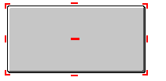

(name subject to change)

The BTA GUI Transfer Protocol

### Why should it be implemented:

BGTP is a extension of GUI components made to enable the addition of JSON defined GUIs to BTA. The uses cases for such a system are two fold:

- ###### server side plugins:
As BGTP allows the server to draw arbitrary interfaces into the client, it enables far more complex custom interactions with the players. some examples would be interactive login screens, trade and buy interfaces, custom loading screens, custom HUD elements for something like factions, RPG skill trees, minigame selection screens, etc.

- ###### mods:
BGTP is also very useful for mods because it simplifies the process of designing UIS, right now, each GUI is drawn for scratch every time from a PNG file. With the system implemented the process could be simplified to a JSON file (or just programmed with a OOP interface, really.) using standard UI widgets such as progress bars, buttons, sliders and item slots alongside some "meta" widgets like image, text and spacers. ALL of that without ever importing OpenGL (as long you don't need to use a custom widget.).

### What a BGTP file should look like:

A BGTP consists of a array of BGTP widgets. A BGTP widget should have a few basic attributes: **a class, it's parents, a id, offset x and y and arguments.**

##### Classes:

the class determinates what function a given widget should call on render. They are identified by namespace strings.

* A namespace is laid out as:

`{mod id}${name}.{sub-name}`

`"class":"Aether$MoaGrinder.progressbar"`

* Sub-names can also be sub-named as needed.

`Aether$MoaGrinder.progressbar.reactive`

##### ID:

A arbitrary unique identifier for a given widget, they are only relevant from inside their own GUI and thus have a scope. **They are not global and cannot exceed 256 characters**. The only convention recommended is to replace spaces with underscores, delimitate sub-names with periods and namespaces with dollar signs.

###### examples:
```
Aether$progress
Aether$holystone_furnance.progress
Aether$holystone_furnance.progress.1
Aether$holystone_furnance.progress.2
```

The ID is used by the UI to get the current information of a given widget and it is sent back to the server together with relevant data when the server. Along side that they are also used to determinate the parent of a widget. As such some sub-names are reserved, more to be followed in the parent section.

##### Parents:

The parent determinates the X, Y origin of a widget and what is it drawn over. The default parent is `"Minecraft$window.center"`.

##### Parent Anchors

- `.center`
- `.top_center`
- `.bottom_center`
- `.right`
- `.top_right`
- `.bottom_right`
- `.left`
- `.top_left`
- `.bottom_left`

*you can visually see them here:*



##### offsets:

It is simply the offsets between the anchor point(parent) and where the widget is drawn.

##### arguments:

the arguments(`args`) are simply a array of values that is used to construct the widget.

##### BGTP Example:

This is a example of a simple GUI that says "Hello Word" over a white backgroud.

```json
[
        {
                "class": "Minecraft$inventory.background",
                "parent": "Minecraft$window.center",
                "id": "BGTP$demos.empty_container",
                "offset": {
                        "x": 50,
                        "y": -3,
                },
                "args": {
                        "x_size":176,
                        "y_size":86,
                }
        },
        {
                "class": "Minecraft$base.text",
                "parent": "BGTP$demos.empty_container",
                "id": "BGTP$demos.empty_container.text",
                "offset":{
                        "x": 50,
                        "y": 0
                },
                "args": {
                        "content":"Hello World"
                }
        }
]
```

**result:**


